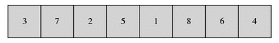
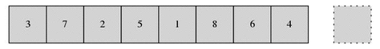
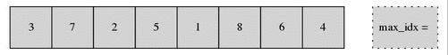
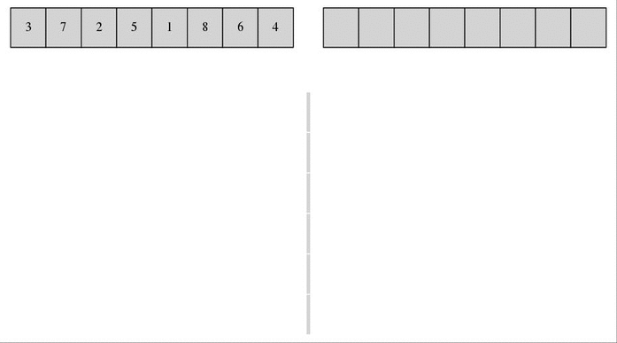
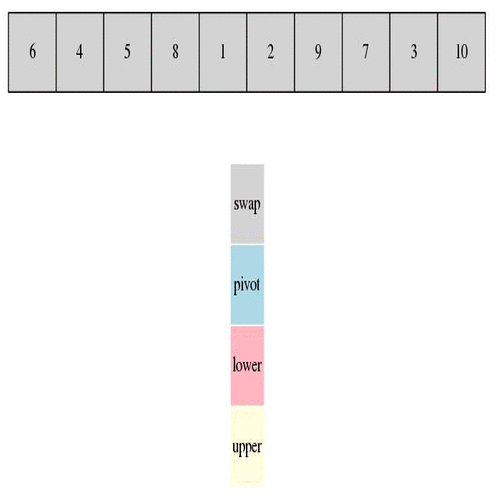

# sort

## Prerequisition

```
$ sudo apt install graphviz
$ sudo apt-get install imagemagick
```

  

### 1\_Bubble Sort

  

### 2\_Insertion Sort



  

### 3\_Selection Sort



### 4\_Merge Sort



### 5\_Quick Sort

